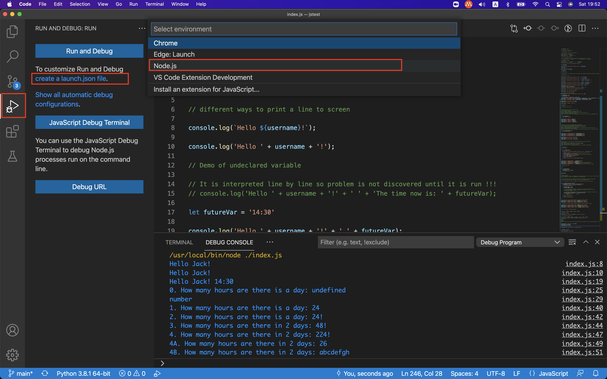
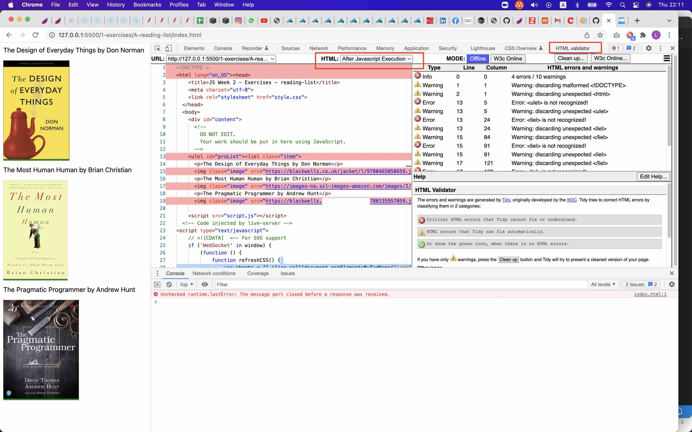
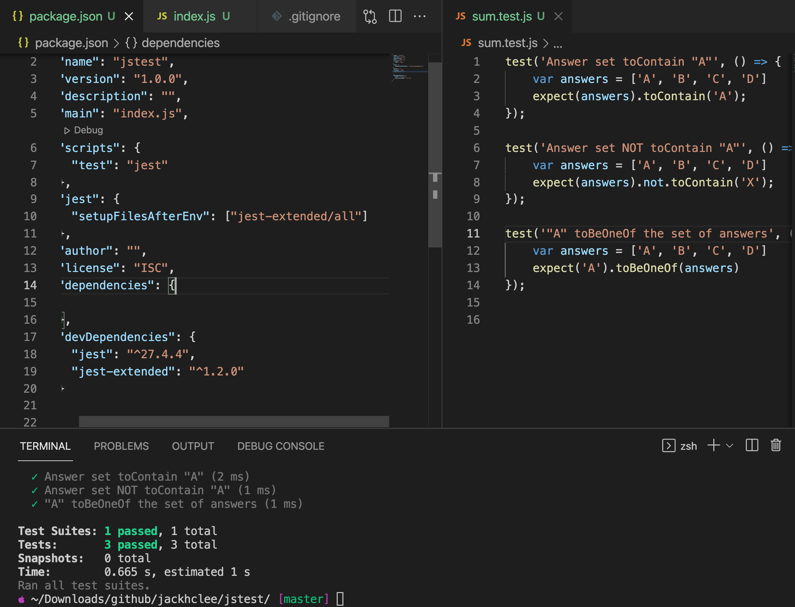
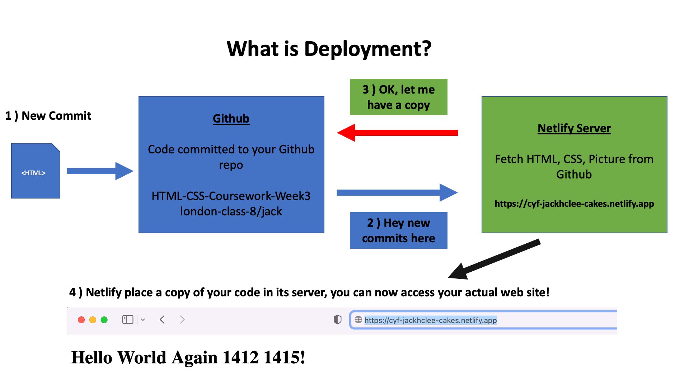
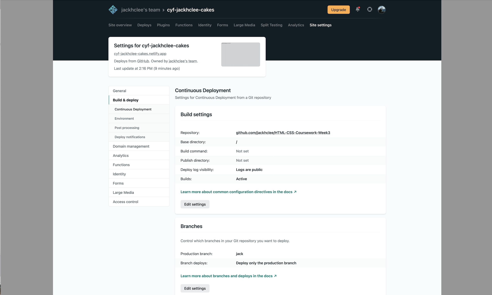
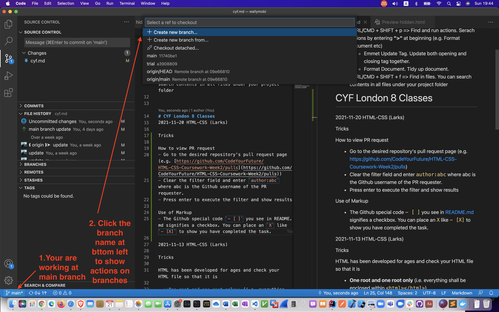
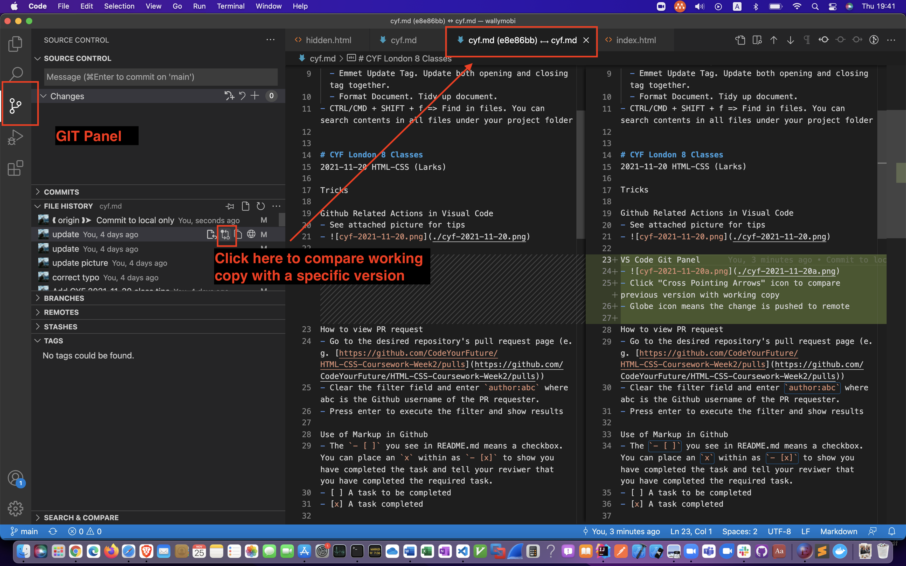

# Tools

## VS Code
VS Code Extensions
- [HTML Preview](https://marketplace.visualstudio.com/items?itemName=tht13.html-preview-vscode) - Allow preview on HTML file
- [Markdown All in One](https://marketplace.visualstudio.com/items?itemName=yzhang.markdown-all-in-one) - Allow preview on Markdown file

VS Code Hotkey
- CTRL/CMD + SHIFT + p => Find and run actions. Serach actions by entering **">"** at beginning (e.g. Format document etc)
  - Emmet Update Tag. Update both opening and closing tag together.
  - Format Document. Tidy up document.
- CTRL/CMD + SHIFT + f => Find in files. You can search contents in all files under your project folder

Run and Debug within VS Code
- Configuration
- If you have never setup Run and Debug in the project. 
  
- Click the "Run and Debug" icon at leftmost menu bar
- Click "create a launch.json file"
- In the "Select environment" pull down menu, choose "Node.js"

- If you can't debug by above steps.
  
- Open the `launch.json` file under current project's `.vscode` folder
- Check `type` attribute is `pwa-node` and `program` is points to the JS file you want to run/debug. Keep the `${workspaceFolder}/` part.
- You shall be able to debug within VS Code by pressing F5 or select from menu `Run` > `Start Debugging`.
- Click "Run and Debug" icon at leftmost menu bar and then click the green run button.

Run and Debug Code VS Code (Jest)
- Configuration
- Run `npm install` to get all necessary NPM modules
- If you have never setup Run and Debug in the project. 
  
- Click the "Run and Debug" icon at leftmost menu bar
- Click "create a launch.json file"
- Open the `launch.json` file under current project's `.vscode` folder
- Edit corresponding `configurations` element. You may refer to to sample [launch.json](https://github.com/jackhclee/wallymobi/blob/main/launch.json). Add a configuration named `Jest Current File`. Save it.
- Open a test specification file written in Jest. (i.e. JS file with expect and test functions)
- Ensure the `Jest Current File` configuration is selected in `Run and Debug` file.
- Start debugging by pressing F5 or select from menu `Run` > `Start Debugging`. or
- Click "Run and Debug" icon at leftmost menu bar and then click the green run button.
- Set breakpoints and check the running conditions

## Chrome
Chrome Extensions
- [DevDocs](https://chrome.google.com/webstore/detail/devdocs/mnfehgbmkapmjnhcnbodoamcioleeooe?hl=en-GB) - Local offline copy of various development documentations.
- [HTML Validator](https://www.gueury.com/mozilla/download.html) - DOM Validation
## Useful Linux / OSX Tricks
### ZSH
You may consider using ZSH

# CYF London 8 Classes

2022-02-05 JS2-Week3 (Larks)

2022-01-29 JS2-Week2 (Larks)
- [Exercises answers](https://github.com/jackhclee/wallymobi/blob/main/cyf-2022-01-29.js)

2022-01-15 JS1-Week4 (Larks)

| Func     | Head | Body | Tail |
| -------  | ---- | ---- | ---- |
| push     |      |      | Tail |
| pop      |      |      | Tail |
| shift    | Head |      |      |
| unshift  | Head |      |      |
| splice   |      |      |      |

| Func     | Chainable | New Array Returned | New Array Size |
| -------- | --------- | ------------------ | -------------- |
| map      | Yes       | Yes                | Same as input  |
| filiter  | Yes       | Yes                | Depends        |
| sort     | Yes       | No                 | Same as input  |
| foreach  | No        | No                 | NA             |
| find     | No        | No                 | NA             |

2022-01-08 JS1-Week3 (Larks)
Use HTML Validator to check DOM

2021-12-18 JS1-Week2 (Larks)

2021-12-11 JS1-Week1 (Larks)
### Tricks
#### You might not know you are using JavaScript ...
- VS Code is written in [JavaScript](https://www.quora.com/What-is-Visual-Studio-Code-written-in) 

#### Testing for JavaScript
- Using `toBeOneOf` in Jest `toBeOneOf` is an from `jest-extended` and you need to configure in package.json and run npm install to download necessary NPM modules

2021-12-04 HTML-CSS (Larks)

### Tricks

#### Testing Edge Cases
We usually test programs with extreme / edge scenarios.

#### How to save a website local archive
In Chrome, right click on "Save as"
#### Great books on JavaScript
- Eloquent Javascript by Marijn Haverbeke [https://eloquentjavascript.net/](https://eloquentjavascript.net/) 

2021-11-27 HTML-CSS (Larks)

Tricks

Put your HTML page on Internet. Deploy it to a real server.
- You commit your code changes at Github and notify Netlify for deployment
- 
- Make sure you are deploying the rigth *Base Directory* and *Production branch*
- 

2021-11-20 HTML-CSS (Larks)

Tricks

Github Related Actions in Visual Code
- See attached picture for tips
- 

VS Code Git Panel
- 
- Click "Cross Pointing Arrows" icon to compare previous version with working copy
- Up pointing arrow means pending changes to be pusheded to remote

How to view PR request
- Go to the desired repository's pull request page (e.g. [https://github.com/CodeYourFuture/HTML-CSS-Coursework-Week2/pulls](https://github.com/CodeYourFuture/HTML-CSS-Coursework-Week2/pulls))
- Clear the filter field and enter `author:abc` where abc is the Github username of the PR requester.
- Press enter to execute the filter and show results

Use of Markup in Github
- The `- [ ]` you see in README.md means a checkbox. You can place an `x` within as `- [x]` to show you have completed the task and tell your reviwer that you have completed the required task.
- [ ] A task to be completed
- [x] A task completed

2021-11-13 HTML-CSS (Larks)

Tricks

HTML has been developed for ages and check your HTML file so that it is

- **One root and one root only** (i.e. everything shall be enclosed within `<html></html>`)
- Check HTML Well Form-ness
Each opening element shall have an closing element (`

`) or
element is self closing (``)
 

Define then Apply
- Write definition (e.g. CSS definitions) before you use in the code.
- Usually re-definiton is allowed and always overwrite earlier definitons. **Unknown overwite is a common source of problem.**

Hyperlink
Absolute vs Relative resources
- `<a href="https://apple.com">This is a absolute link to Apple.com</a>`

- ``

Anything not starting with https:// http:// ftp:// mail:// or / etc are relative

- `<a href="hidden.html">This is a relative link to hidden.html on this site</a>`
-  ``

Missing Link / Resources?
- Fireup Developer Tools => Network and check. You can access the tool by 1) Right click on the page and select Inspect or 2) Press F12 button
- 

